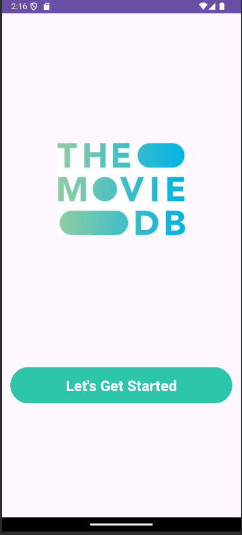
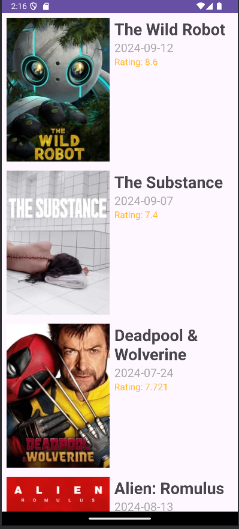
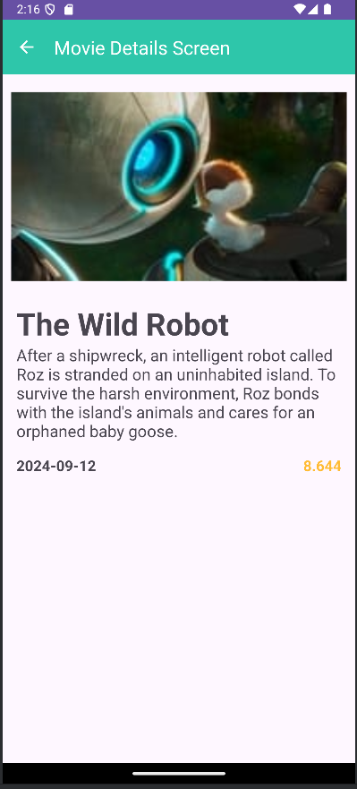

# Android Movies App Made by Jaafar Fares For Barsha Technology

The Android Movies App lets users explore and view detailed information about movies, including titles, ratings, and release dates. Built using Kotlin and following the MVVM architecture, the app fetches movie data from The Movie Database (TMDb) API.

### Screenshots

  
  
  

#### Note: Make sure to add your API key in the gradle.properties file.

